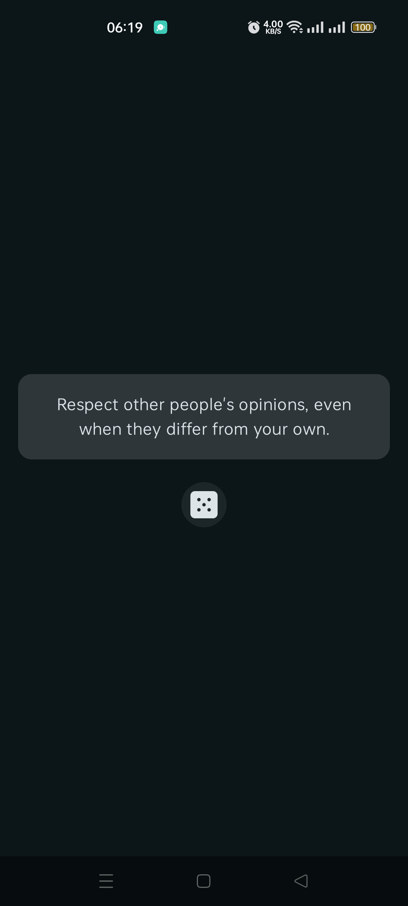
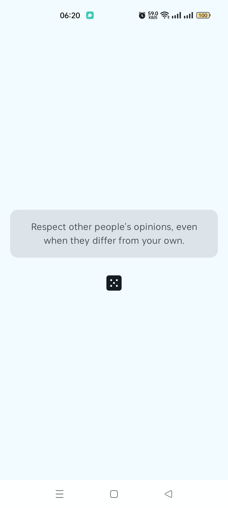

# Advice Generator
 
This is a version of the Advice Generator
app [that I did with React Native](https://github.com/Mirror83/advice-generator-app)
built with [Jetpack Compose](https://developer.android.com/compose).
The purpose of this was to refresh myself on Android development concepts, and also to learn how
to make widgets with [Jetpack Glance](https://developer.android.com/develop/ui/compose/glance).

## Libraries used

- [Retrofit2](https://square.github.io/retrofit/) and [okhttp](https://square.github.io/okhttp/) -
  used to make network requests
- [Kotlinx Serialization](https://github.com/Kotlin/kotlinx.serialization) with
  Retrofit [kotlinx-serialization-json](https://github.com/square/retrofit/tree/trunk/retrofit-converters/kotlinx-serialization)
  converter - used to parse JSON responses
- Jetpack Compose - used to build the UI
- [Hilt](https://developer.android.com/training/dependency-injection/hilt-android) for dependency injection

## Screenshots

